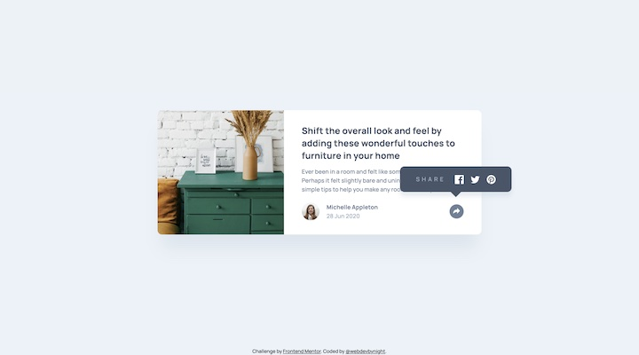

# Frontend Mentor - Article preview component solution

This is a solution to the [Article preview component challenge on Frontend Mentor](https://www.frontendmentor.io/challenges/article-preview-component-dYBN_pYFT). Frontend Mentor challenges help you improve your coding skills by building realistic projects. 

## Table of contents

- [Overview](#overview)
  - [The challenge](#the-challenge)
  - [Screenshot](#screenshot)
  - [Links](#links)
- [My process](#my-process)
  - [Built with](#built-with)
  - [Useful resources](#useful-resources)
- [Author](#author)

## Overview

### The challenge

Users should be able to:

- View the optimal layout for the component depending on their device's screen size
- See the social media share links when they click the share icon

### Screenshot

### Links

- Solution URL: [https://github.com/webdevbynight/article-preview-component-master](https://github.com/webdevbynight/article-preview-component-master)
- Live Site URL: [https://webdevbynight.github.io/article-preview-component-master/](https://webdevbynight.github.io/article-preview-component-master/)

## My process

### Built with

- Semantic HTML5 markup
- CSS (via SCSS)
  - custom properties
  - logical properties
  - flexbox
  - grid
- JavaScript (via TypeScript)
- Mobile-first workflow
- Microdata

### Useful resources

- [Detect JavaScript Support in CSS](https://ryanmulligan.dev/blog/detect-js-support-in-css/) - This helped me to serve CSS declarations which are applicable only when JavaScript is enabled just by using media queries and without any need for adding a class like `.js`.

## Author

- Website - [Victor Brito](https://victor-brito.dev)
- Frontend Mentor - [@webdevbynight](https://www.frontendmentor.io/profile/webdevbynight)
- Mastodon - [@webdevbynight](https://mastodon.social/webdevbynight)
